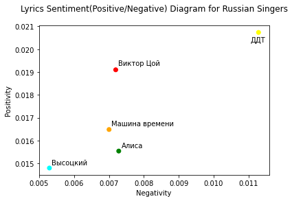
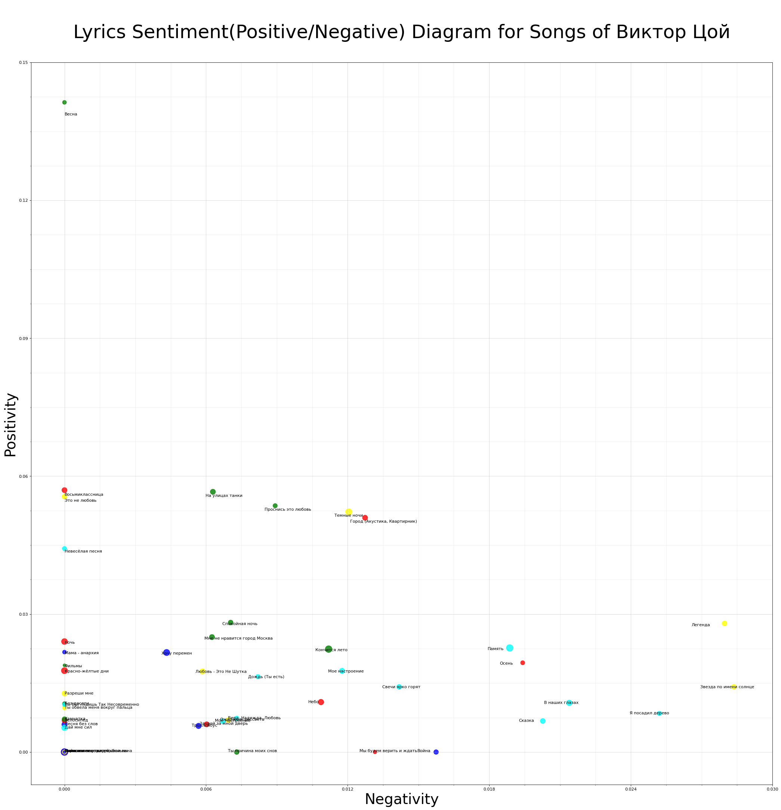
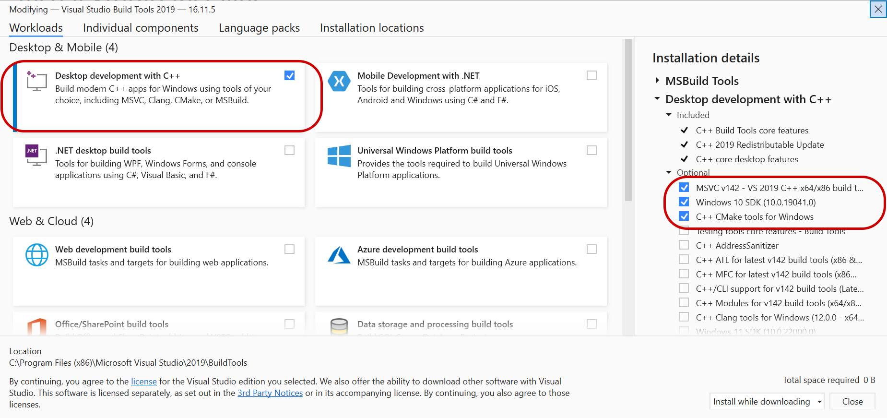

<!DOCTYPE html>
<html lang="en" data-color-mode="auto" data-light-theme="light" data-dark-theme="dark">
<head>
</head>
<body>
<h1>Project Description</h1>

This project analyses lyrics sentiment of Russian singers and bands such as <i>Виктор Цой</i>, <i>Алиса</i>, <i>ДДТ</i>, <i>Машина времени</i>, <i>Высоцкий</i>.
According to the analysis the most neutral singer/band is <i>Владимир Высоцкий</i> and the most emotional one is <i>ДДТ</i>.

The project includes code for songwise sentiment analysis as well. The example of this can be seen below. Zoom in to see the names of the songs.

The project includes sample code for web-scraping and cleaning of raw data that was used to collect and process the actual lyrics data.

<h1>Sentiment Analysis Package</h1>

Sentiment analysis package used in this project is <a href="https://github.com/bureaucratic-labs/dostoevsky">`dostoevsky`</a>-library under version of `0.6.0`. During installation, `dostoevsky`-package might require <i>Microsoft Visual C++</i> of `14.0` or greater version. When installing <i>Microsoft Visual C++</i> be sure to include the following components.

</body>
</html>